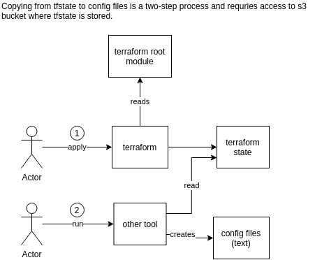

Overview
--------

This module makes it easy to extract terraform state at the time of
`terraform apply` and automatically update config files used by other
systems or tools separate from terraform such as helm or kubectl, but 
which depend on some infrastructure state or settings such as database
addresses, security group ids, etc. 

This module has been used in several closed source projects to generate 
helm values files and could surely be used to generate kustomize files, 
ansible files, etc. This module is especially useful to those 
not using the kubernetes or helm providers. 




The main concepts in this module "stacks", "namespaces" and "config" 
files: 

- a stack is an instance of a set of resources that describe a complete
  environment. Eg a VPC, subnets etc, plus an EKS cluster, plus 
  IAM, security groups, databases, lambdas, all for one environment, 
  is a stack. There could be a dev stack, a staging stack, a prod 
  stack. In the dev stack there could be multiple instances of an 
  application, each for a different developer. The precise meaning 
  will depend on your situation, but the term is used to refer to the
  totality of a set of resources that logically belong together. 
- a namespace is a subdivision of this stack into blocks. Think 
  kubernetes, but this is just the term used for subdivision.
- a config is a text file or set of text files that contain settings
  that are required to do something outside of terraform with the 
  resources of the stack/namespace. This could be the values files 
  for a particular deployment of an "app" in a namespace of the 
  stack (vpc + cluster).


Usage
-----

Using this is very simple, and best understood by looking in the
examples folder. Simplest example: you have `YOUR_TF_MODULE/main.tf`, 
and you need to get the AWS RDS DB address into the helm chart values 
file of YOUR_APP_DIR which represents a container deployed in your 
kubernetes cluster: 

- In `YOUR_APP_DIR/config/_templates_/base-auto-root-values.yaml` 
  put the following: 
  ```
  user_url: http://${cluster_name}/user/id
  security:
    group1: ${sg_ingress}
  region: ${aws_region}
  ```

- in `YOUR_TF_MODULE/main.tf`, put this: 
  ```
  module "gen_helm_values" {
    source = "git::https://github.com/schollii/terraform-local-gen-files.git"

    stack_id     = "YOUR_CLUSTER_NAME"
    config_roots = ["YOUR_APP_DIR/config"]
    tpl_name     = "values.yaml"

    # the keys and values in template_vars are completely arbitrary:
    template_vars = {
      cluster_name  = "YOUR_CLUSTER_NAME"
      sg_ingress    = "SOME_SG_ID"
      aws_region    = "us-east-1"
    }
  }
  ```

- In `YOUR_TF_MODULE`, run `terraform init` then `terraform apply`: 
  this will load the `YOUR_APP_DIR/config/_templates_/base-auto-root-values.yaml` 
  file as a terraform template, replace all occurrences of the keys of 
  `tmpl_vars` by the corresponding values, and write the result to 
  `YOUR_APP_DIR/config/stacks/YOUR_CLUSTER_NAME/base-auto-root-values.yaml`. 

This scales nicely:

- you can have multiple stacks/clusters: each app will have the 
  correct values for all the different stacks they need values from, 
  in clearly recognizable folders. 
- you can "specialize" the templates for individual namespaces (check 
  out `namespace` variable), and for individual clusters
- you can have a global config file at the root of the stacks folder
  (it is therefore static)
- you can have a large number of services, you don't need to remember 
  which service depends on which terraform state data; once in the 
  template, and in your terraform config files, the association is
  easy to identify at any time
- independent modules of your terraform config can each be responsible
  for their own outputs, no need to trickle outputs all the way to 
  the top. Eg `YOUR_APP_DIR/config/_templates_/module1.yaml`
  and `$YOUR_APP_DIR/config/_templates_/module2.yaml`
- when `terraform apply` changes something in the infrastructure that 
  impacts services, it is clear which services are impacted. You can 
  then run helm install/upgrade or kubectl apply on only those 
  services. 

The main challenge is to decide on the order in which to combine all 
the generated config files. However for helm and kustomize this is 
typically fairly obvious: from most to least specific, ie global/base,
auto-root, auto-cluster, auto-namespace; and at each level, the 
generated configs take precedence over any static ones. Since the 
files are known for each service, a helmfile can be useful to 
capture the list of config files and their order. 


Contributions
-------------

Contributions and requests are welcome. It could be made less 
specific to kubernetes if there is interest. 